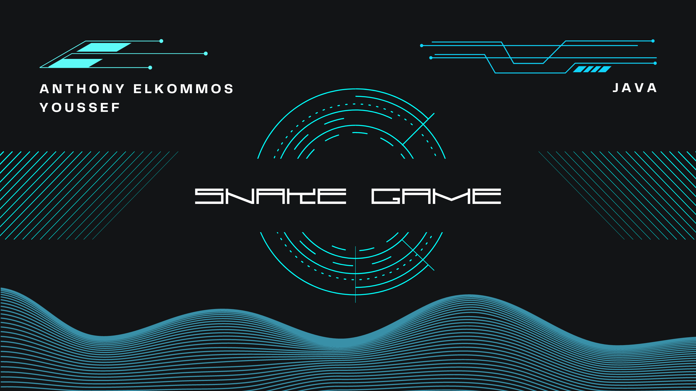

# Snake Game

This is a simple implementation of the classic Snake Game in Java. The game is built using Java Swing for the GUI.

## Game Features

- The game starts with a small snake that grows as it eats apples.
- The game ends when the snake collides with itself or the borders of the game panel.
- The game keeps track of the score which is the number of apples eaten.
- The game can be restarted by pressing the 'Space bar' key after the game ends.
- The game also keeps track of the high score across all games and saves it to a high score file so that it can be 
accessed even after the game is closed.
- The game can be paused and resumed by pressing the 'P' key.
- The game can be exited by pressing the 'Esc' key.
- The game speed can be controlled by pressing the 'd' key to increase the speed and the 's' key to decrease the speed.

## How to Run the Game

1. Clone this repository to your local machine.
2. Open the project in your preferred Java IDE (like IntelliJ IDEA).
3. Run the `SnakeGame.java` file to start the game.

## Screenshots

Here are some screenshots of the game:

## Contributing

Pull requests are welcome. For major changes, please open an issue first to discuss what you would like to change.

## License

[MIT](https://choosealicense.com/licenses/mit/)